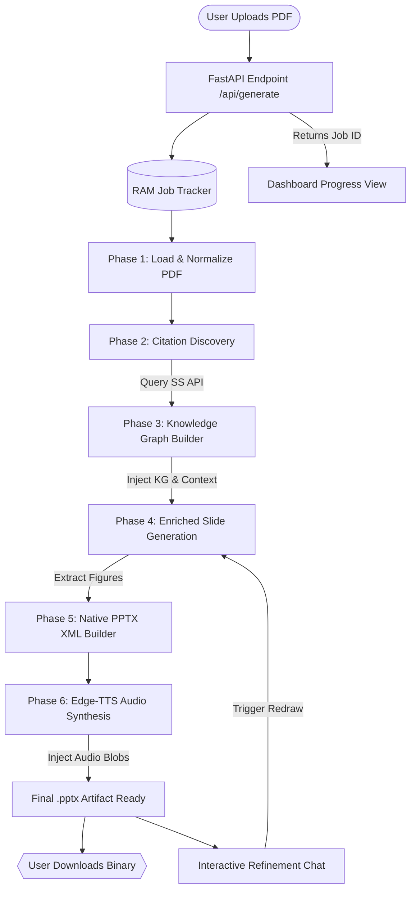

# 🎙️ Paper2Slides: Engineering Deep-Dive
### *Internal Onboarding & Architectural Overview*

---

## 🎯 The Problem & The Vision

### Why does this tool exist?
Academic consumption is bottlenecked. Researchers, students, and industry analysts must ingest thousands of dense, equation-heavy PDFs annually. Traditionally, summarizing these for presentations is a **labor-intensive, lossy process** prone to user fatigue.

**Paper2Slides solves this by providing Instant Authority.**
It does not merely summarize; it executes cognitive mapping, locates citation networks, and synthesizes high-fidelity, visually-balanced presentations with fully narrated hidden speaker tracks in under 60 seconds.

---

## 🏗️ High-Level Architecture Matrix

The platform utilizes a specialized tiered stack engineered for stability, visual delight, and elastic AI processing:

### 1. The Engine Core (Backend)
*   **Framework**: FastAPI (Asynchronous Python Framework)
*   **Primary Orchestrator**: `main_api.py` utilizing background worker tasks for non-blocking thread execution.
*   **Reasoning Core**: **Amazon Bedrock (Mistral Large)** via `mistral_llm` bridge, engineered with dynamic payload formatting and smart adaptive retries (`boto3` integration) to gracefully handle strict rate limits and throttling.
*   **IO Layers**: `PyMuPDF` (PDF geometry decoding) & `python-pptx` (Direct XML manipulation for layout generation).
*   **Vocal Interface**: `Edge-TTS` asynchronously records hidden narrations per slide.

### 🔍 Component Responsibility Matrix
| Component Module | Direct Responsibility | Core Tech Utilized |
| :--- | :--- | :--- |
| `main_api.py` | FastAPI gateways, RAM job tracker, WebSocket-emulating polling. | `FastAPI`, `pydantic`, `asyncio` |
| `static/index.html` | Glassmorphic frontend UI dashboard & real-time logging console. | Vanilla JS, CSS3 Keyframes |
| `citation_extractor.py` | Ref discovery, SS API fetching, dynamic throttling. | `requests`, `re` |
| `knowledge_builder.py` | Extraction of Atomic Claims & Graph Topology inference. | `JSON` strict parsing |
| `paper2ppt_cli.py` | Text extraction, Bullet engineering, Final PDF normalization. | `PyMuPDF`, Regex |
| `pptx_builder.py` | Direct XML generation, image placing, math parse. | `python-pptx`, `PIL` |

---

## 🔄 The End-to-End Processing Cycle

Below is the definitive visual and logical lifecycle of a single user request:

### 📊 Runtime Workflow Sequence


### 🧩 Phase Detailed Breakdown

### Phase 1: Intake & Isolation
The moment the user uploads a PDF, the API records the job in RAM, returns a `202 Accepted` status immediately to keep the UI fluid, and spins off a detached background worker.

### Phase 2: The Discovery Matrix (`citation_extractor.py`)
Before processing content, the pipeline isolates the **Abstract** and **References** block. 
*   It executes robust pattern matching (IEEE/numeric) to segment the bibliography.
*   It runs an LLM prompt to curate the **Top 5 most influential foundational citations**.
*   It queries the **Semantic Scholar Open API** to retrieve external abstracts and Open-Access PDFs for these relative nodes.

### Phase 3: The Knowledge Graph (`knowledge_builder.py`)
Using strict structured JSON responses, we distill both the core paper and the acquired citations into atomic **Claims** and **Entities**. 
*   The engine synthesizes a relational graph topology (e.g., identifying "Paper A builds directly on Architecture of Citation X").

### Phase 4: Enriched Slide Synthesis (`paper2ppt_cli.py`)
We pass the textual section context AND the newly built Knowledge Graph into the final Prompt Harness. The LLM uses the KG to anchor its answers, weaving in scholarly validation and relational context, ensuring slides state *why* a theorem matters relative to external research.

### Phase 5: Narrative Laydown & Injection
The finished bullets are converted into dynamic speaker scripts. Edge-TTS reads these to memory, and we inject the binary audio blobs directly into the XML tree of each slide before packaging the finalized `*.pptx` binary.

### Phase 6: Interactive Refinement Bridge (Post-Generation)
Users enter conversational chat mode. They query a slide. The FastAPI listener parses the query, identifies the single relevant node using semantic routing, regenerates only that branch of logic, and dynamically splices the new slide back into the live stack in seconds.

---

## 🔬 Critical Engineering Design Decisions

1.  **Extraction over Generation**: We enforce a "Synthesis over Repetition" directive. We strictly strip broken mathematical fragments and noise before generation to prevent the PPTX from looking garbled.
2.  **Zero-NPM Mandate**: By refusing frameworks like React/Vue for this interface, we eliminate hundreds of megabytes of `node_modules`, guaranteeing that anyone can spin the UI up on ANY environment instantly without an install step.
3.  **State-Preservation Job Queueing**: All jobs run in standalone background tasks referenced by unique UUID strings. Even if a network request fails on the browser, the computation continues gracefully on the server.

---

### 📖 Quick-Start Onboarding Commands
To investigate this environment, a new dev should inspect these paths first:
*   `/main_api.py`: The primary nervous system and API endpoints.
*   `/paper2ppt_cli.py`: The actual heavy-lifter building the slides.
*   `/citation_extractor.py`: Our bridge to external academic networks.

***
*(End of Overview)*

---

## 🛠️ Operations & Deployment Guide

### Environment Setup
Before running the application, ensure your `.env` file is populated with valid AWS credentials granting access to Amazon Bedrock:
```env
AWS_ACCESS_KEY_ID=your_access_key
AWS_SECRET_ACCESS_KEY=your_secret_key
AWS_REGION=us-east-1
BEDROCK_MODEL_ID=mistral.mistral-large-2402-v1:0
```

### Running the Application
The platform consists of two persistent services: a FastAPI backend and a Streamlit frontend. They should be run in the background.

**1. Start the Backend API (Port 8000):**
```bash
source venv/bin/activate
nohup uvicorn main_api:app --host 0.0.0.0 --port 8000 > api_server.log 2>&1 &
```

**2. Start the Web UI / Streamlit (Port 80):**
*(Note: Binding to Port 80 requires sudo privileges)*
```bash
sudo bash -c "source venv/bin/activate && nohup streamlit run app.py --server.port 80 --server.address 0.0.0.0 > streamlit_output.log 2>&1 &"
```

### Stopping the Application
To restart services or forcefully clear the ports, use `pkill` to terminate the processes by their execution signatures:

**Kill Backend API:**
```bash
sudo pkill -f "uvicorn main_api"
```

**Kill Web UI:**
```bash
sudo pkill -f "streamlit"
```
